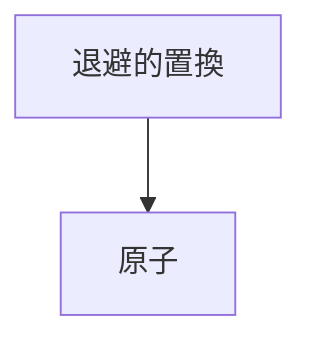
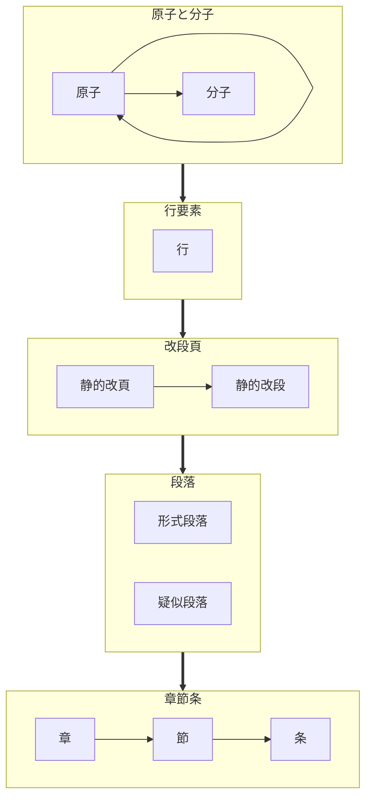
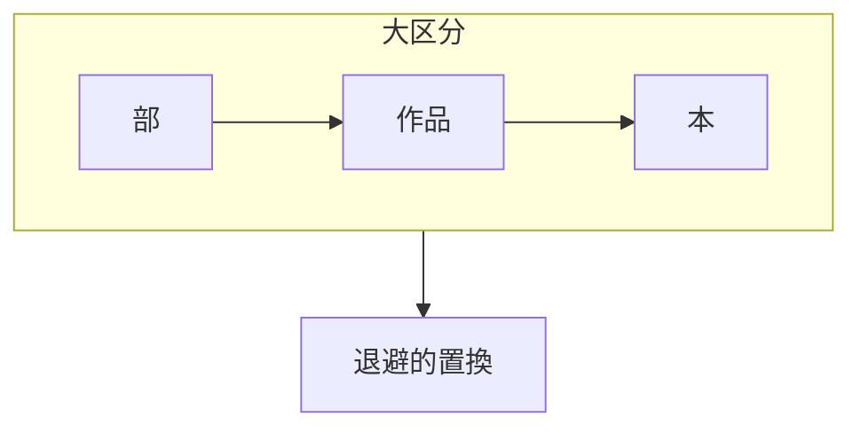

## 組版パーツ
- ブロック要素…登場順序がほぼ決まっている。再帰しない。
  - ファイル単位
    - 本:header>Title
  - 意味段落
    1.  段落・疑似段落
        - 段落:p.ltlbg_Paragraph
        - 会話集合などの疑似段落:p.ltlbg_SubParagraph
    2.  セクション
        1.  項:section.ltlbg_SubSection
        2.  節:section.ltlbg_Section
        3.  章:section.ltlbg_Chapter
    3.  大区切り
        1.  部:article.ltlbg_Part
        2.  作品article.ltlbg_workTitle
  - 形式段落
    - 静的改ページ:pagebreak-after
    - 静的改段:実現できるか？
    - 静的改行:br.ltlbg_Br

- 行要素…修飾要素を含むが再帰しない。
  - 空行:Br.ltlbg_BlankLine
  - 会話:i.ltlbg_Talk1など
  - 思考:i.ltlbg_Think1など
  - 章見出し:H2.ltlbg_ShoTitle
  - 題:H1.ltlbg_SakuhinTitle

- 修飾要素…登場順序が多様
    1. 修飾原子:配下にタグを含まない。入れ子しない要素。1度の置換で完了
       - 回転:Span.ltlbg_Kaiten
       - 踊り字:Span.ltlbg_Odori1
       - ダーシ:Span.ltlbg_Dash
       - 縦中横:Span.ltlbg_Tcy
       - 全角空白文字:Span.ltlbg_wSp
       - など
       - ※変換効率の観点から恣意的に分子化順序を操作する前提で、入子が可能なタグでも原子にするものがある
    2. 修飾分子:配下に原子を含む。
       - ルビ:ruby.ltlbg_Ruby
       - 傍点:em.ltlbg_Emphasis
       - 太字:b.ltlbg_bold
       - など

## 置換タイミングと要素の整理
  
| タイミング      | 要素     | 効果             | 対象文字、状況           |
| --------------- | -------- | ---------------- | -----------------------  |
| 前処理と後処理  | 退避対象 | 右大不等号       | `<`or`＜`                | 
| 前処理と後処理  | 退避対象 | 左大不等号       | `>`or`＞`                | 
| 前処理と後処理  | 退避対象 | アンパサンド     | `&`or`＆`                | 
| 前処理と後処理  | 退避対象 | ダブルクォート   | `"`or`”`                | 
| 前処理と後処理  | 退避対象 | シングルクォート | `'`or`’`                | 
| 前処理と後処理  | 退避対象 | コロン           | `：`or`:`                | 
| 前処理と後処理  | 退避対象 | セミコロン       | `；`or`;`                | 
| 前処理          | 原子     | 後ろ空白         | ！や？の後に空白(が無い) | 
| 前処理          | 原子     | 自動縦中横       | ！や？、英数の重なり     | 
| 前処理          | 原子     | 改行             | 改行コード               |
| 前処理          | 原子     | 空行             | 行頭改行コード           |
| 前処理          | 原子     | 全角空白         | 行頭以外の全角空白       | 
| 前処理          | 原子     | 半角空白         | 半角空白                 | 
| 主処理          | 原子     | ダーシ           | `―`or`――`             |  
| 主処理          | 原子     | 踊字             | `／＼`or`〱`             |
| 主処理          | 原子     | エロ濁点         | `゛`                     | 
| 主処理          | 原子     | 縦中横           | `^XX^`                   | 
| 主処理          | 原子     | 回転対応         | `[^字^]`                 | 
| 主処理          | 原子     | 字幅対応         | `[-字-]`                 | 
| 主処理          | 原子     | 強制合字         | `[l[字]r]`               | 
| 主処理          | 分子     | 傍点             | `《《傍点》》`           | 
| 主処理          | 分子     | 太字             | `**太字**`               | 
| 主処理          | 分子     | ルビ             | `{母字｜ルビ}`           | 
| 主処理          | 分子     | ルビ             | `｜母字《ルビ》`         | 
| 主処理          | 行       | 「会話」         | 行頭`「`から`」`         | 
| 主処理          | 行       | 『会話』         | 行頭`『`から`』`         | 
| 主処理          | 行       | （思考）         | 行頭`（`から`）`         | 
| 主処理          | 行       | 〝強調〟         | 行頭`〝`から`〟`         | 
| 主処理          | 行       | ――会話         | 行頭`――`から改行まで   | 
| 主処理          | 行       | ＞会話           | 行頭`＞`から改行まで     |     
| 主処理          | 行       | 線               | `---`                    | 
| 主処理          | 行       | 章タイトル       | 行頭`§`or`◆`or`■`     |
| 主処理          | 章節条   | 章区切り         | `[chapter:章idx]`        | 
| 主処理          | 章節条   | 節区切り         | `[chapter:章idx]`        | 
| 主処理          | 章節条   | 条区切り         | `[chapter:章idx]`        | 
| 主処理          | 段落     | 会話等の疑似段落 | 連続する括弧類の行       |   
| 主処理          | 段落     | 改頁             | `[newpage]`              | 
| 主処理          | 段落     | 段落             | 行頭全角空白             | 
| 後処理          | 大区切   | 部               | ※未定                   | 
| 後処理          | 大区切   | 作品             | ※未定                   | 
| 後処理          | 大区切   | 本               | ※未定                   | 

# 置換順序

## 全体

## 前処理

## 主処理

## 後処理
