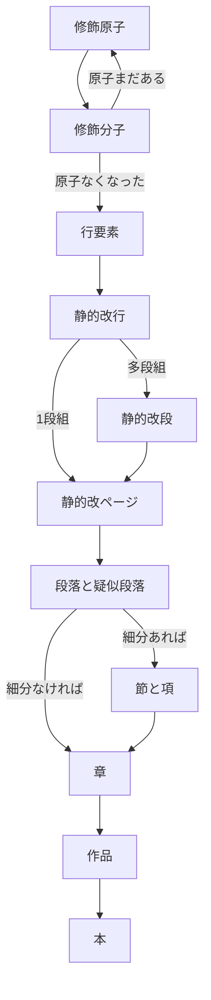

## 組版パーツ
- ブロック要素…登場順序がほぼ決まっている。再帰しない。
  - ファイル単位
    - 本:header>Title
  - 意味段落
    1.  段落・疑似段落
        - 段落:p.ltlbg_Paragraph
        - 会話集合などの疑似段落:p.ltlbg_SubParagraph
    2.  セクション
        1.  項:section.ltlbg_SubSection
        2.  節:section.ltlbg_Section
        3.  章:section.ltlbg_Chapter
    3.  大区切り
        1.  部:article.ltlbg_Part
        2.  作品article.ltlbg_workTitle
  - 形式段落
    - 静的改ページ:pagebreak-after
    - 静的改段:実現できるか？
    - 静的改行:br.ltlbg_Br

- 行要素…修飾要素を含むが再帰しない。
  - 空行:Br.ltlbg_BlankLine
  - 会話:i.ltlbg_Talk1など
  - 思考:i.ltlbg_Think1など
  - 章見出し:H2.ltlbg_ShoTitle
  - 題:H1.ltlbg_SakuhinTitle

- 修飾要素…登場順序が多様
    1. 修飾原子:配下にタグを含まない。入れ子しない要素。1度の置換で完了
       - 回転:Span.ltlbg_Kaiten
       - 踊り字:Span.ltlbg_Odori1
       - ダーシ:Span.ltlbg_Dash
       - 縦中横:Span.ltlbg_Tcy
       - 全角空白文字:Span.ltlbg_wSp
       - など
       - ※変換効率の観点から恣意的に分子化順序を操作する前提で、入子が可能なタグでも原子にするものがある
    2. 修飾分子:配下に原子を含む。
       - ルビ:ruby.ltlbg_Ruby
       - 傍点:em.ltlbg_Emphasis
       - 太字:b.ltlbg_bold
       - など

## 変換概要
### 当スクリプトでの変換対象一覧
> 細かい挙動や仕様は、仕様書を参照してください。
  
| 要素     | 効果             | 対象文字、状況          |
| -------- | ---------------- | ----------------------- |
| 行要素   | 改行             | 改行コード              |
| 行要素   | 空行             | 行頭改行コード          |
| 修飾原子 | ダーシ           | `―`or`――`            |
| 意味段落 | 段落             | 行頭全角空白            | 
| 修飾原子 | 踊字             | `／＼`or`〱`            |
| 行要素   | 「会話」         | 行頭`「`から`」`        | 
| 行要素   | 『会話』         | 行頭`『`から`』`        | 
| 行要素   | （思考）         | 行頭`（`から`）`        | 
| 行要素   | 〝強調〟         | 行頭`〝`から`〟`        | 
| 行要素   | ――会話         | 行頭`――`から改行まで  |
| 行要素   | ＞会話           | 行頭`＞`から改行まで    |     
| 意味段落 | 会話等の疑似段落 | 連続する括弧類の行      |   
| 修飾原子 | 右大不等号       | `<`                     | 
| 修飾原子 | 左大不等号       | `>`                     | 
| 修飾原子 | アンパサンド     | `&`                     | 
| 修飾原子 | ダブルクォート   | `"`                     | 
| 修飾原子 | シングルクォート | `'`                     | 
| 修飾原子 | コロン           | `：`or`:`               | 
| 修飾原子 | セミコロン       | `；`or`;`               | 
| 行要素   | 線               | `---`                   | 
| 修飾原子 | 全角空白         | 行頭以外の全角空白      | 
| 修飾原子 | 半角空白         | 半角空白                | 
| 修飾原子 | 後ろ空白         | ！や？                  | 
| 修飾原子 | 半角英数記号     | ！や？、英数の重なり    | 
| 修飾原子 | エロ濁点         | `゛`                    | 
| 修飾分子 | ルビ             | `{母字｜ルビ}`or        | 
|          |                  | `｜母字《ルビ》`        | 
| 修飾分子 | 傍点             | `《《傍点》》`          | 
| 修飾分子 | 太字             | `**太字**`              | 
| 修飾原子 | 縦中横           | `^XX^`                  | 
| 形式段落 | 章区切り         | `[chapter:章idx]`       | 
| 形式段落 | 節区切り         | `[chapter:章idx]`       | 
| 形式段落 | 項区切り         | `[chapter:章idx]`       | 
| 行要素   | 章タイトル       | 行頭`§`or`◆`or`■`    |
| 形式段落 | 改ページ         | `[newpage]`             | 
| 修飾原子 | 回転対応         | `[^字^]`                | 
| 修飾原子 | 字幅対応         | `[-字-]`                | 
| 修飾原子 | 強制合字         | `[l[字]r]`              | 

## 置換順序
