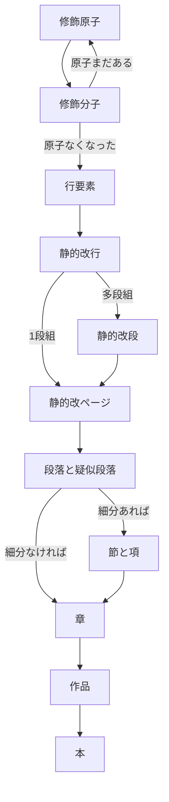

## 組版パーツ
- ブロック要素…登場順序がほぼ決まっている。再帰しない。
  - ファイル単位
    - 本:header>Title
  - 意味段落
    1.  段落・疑似段落
        - 段落:p.ltlbg_Danraku
        - 会話集合などの疑似段落:p.ltlbg_SubDanraku
    2.  セクション
        1.  項:section.ltlbg_Sec4
        2.  節:section.ltlbg_Sec3
        3.  章:section.ltlbg_Sec2
    3.  作品:article.ltlbg_Title
  - 形式段落
    - 静的改ページ:pagebreak-after
    - 静的改段:実現できるか？
    - 静的改行:br.ltlbg_Br

- 行要素…修飾要素を含むが再帰しない。
  - 空行:Br.ltlbg_BlankLine
  - 会話:i.ltlbg_Talk1など
  - 思考:i.ltlbg_Think1など
  - 章見出し:H2.ltlbg_ShoTitle
  - 題:H1.ltlbg_SakuhinTitle

- 修飾要素…登場順序が多様
    1. 修飾原子:配下にタグを含まない。入れ子しない要素。1度の置換で完了
       - 回転:Span.ltlbg_Kaiten
       - 踊り字:Span.ltlbg_Odori1
       - ダーシ:Span.ltlbg_Dash
       - 縦中横:Span.ltlbg_Tcy
       - 全角空白文字:Span.ltlbg_wSp
       - など
       - ※変換効率の観点から恣意的に分子化順序を操作する前提で、入子が可能なタグでも原子にするものがある
    2. 修飾分子:配下にLv0のみを含む。Lv1を処理すればLv3になる
       - ルビ:ruby.ltlbg_Ruby
       - 傍点:em.ltlbg_Emphasis
       - 太字:b.ltlbg_bold
       - など

## 置換順序
